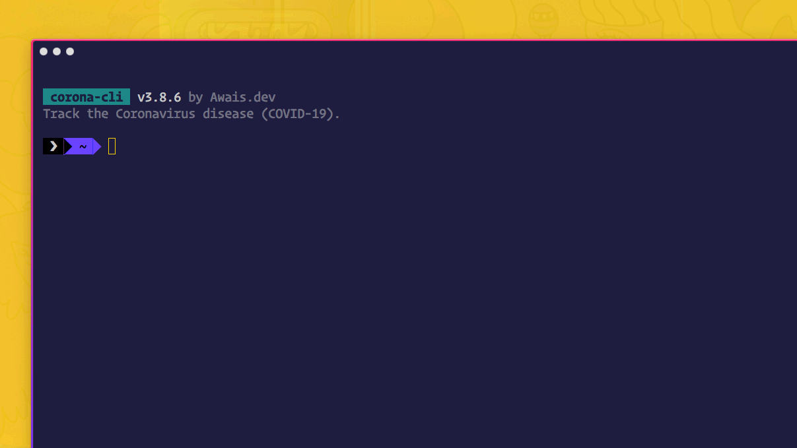

<h4 align="center">
    <a href="https://github.com/ahmadawais/corona-cli">
        
    </a>
    <br>
    <br>

Track the Coronavirus disease (COVID-19) or the Novel Coronavirus Strain.

[](https://www.npmjs.com/package/corona-cli) [](https://VSCode.pro/?utm_source=GitHubFOSS) [](https://twitter.com/mrahmadawais/)

</h4>

<br>

# corona-cli

- 🚀 Get worldwide Coronavirus disease (COVID-19) reporting
- 🤯 Active daily reporting of your country's COVID-19 statistics
- 🇺🇸 Get US States data for Coronavirus disease reports across the US
- 🗃️ Data: Country, Cases, Deaths, Recovered, Active, Critical, Per Million
- 📈 Charts: Plot statistics in the form of line charts both regular and logarithmic
- 📟 Sort: `cases`, `cases-today`, `deaths`, `deaths-today`, `recovered`, `active`, `critical`, `per-million`

<br>

[](./../../)

## Install

```sh
# Install globally (recommended).
npm install -g corona-cli

# Or run directly with npx (installs CLI on every run).
npx corona-cli
```

[](./../../)

<br>

[](./../../)

## Usage

### All Countries

```sh
# Display data for all countries.
corona

# Display data for all countries in single color.
corona --xcolor

# Alias: Display data for all countries in single color.
corona -x
```

[](./../../)

### Single Country

```sh
# Display data for given country.
corona <countryName>

# Display data for given country i.e. China.
corona china

# Display data for given country i.e. USA.
corona usa
```

[](./../../)

### US States Data

```sh
# Display data for all the US states.
corona states

# Display states data sorted by active cases.
corona states --sort active

# Display states data sorted by Cases today.
corona states -s cases-today
```

[](./../../)

### Sort Data

```sh
# Sort data by type
corona --sort country
corona --s cases

# All sorting parameters.
corona -s country
corona -s cases
corona -s cases-today
corona -s deaths
corona -s deaths-today
corona -s recovered
corona -s active
corona -s critical
corona -s per-million

# Reverse sort data
corona --sort active --reverse
corona -s active -r
```

[](./../../)

### Charts: Regular & Logarithmic

```sh
# Print a country line chart.
corona usa --chart
corona usa --c

# Print a country line chart with logarithmic data.
corona china --chart --log
corona china -c -g
```

[](./../../)

### Limit the output

````sh
# Print a limited number of entries to the output.
corona --limit 10
corona -l 10

# Print a bare bones table with no info.
corona --minimal
corona -m
````

#### CLI Help

```sh
# Display the help data.
corona help
corona --help
```

<br>

[](changelog.md)

## Changelog

[❯ Read the changelog here →](changelog.md)

<br>

<small>**KEY**: `📦 NEW`, `👌 IMPROVE`, `🐛 FIX`, `📖 DOC`, `🚀 RELEASE`, and `✅ TEST`

> _I use [Emoji-log](https://github.com/ahmadawais/Emoji-Log), you should try it and simplify your git commits._

</small>

<br>

[](./../../)

## License & Conduct

- MIT © [Ahmad Awais](https://twitter.com/MrAhmadAwais/)
- [Code of Conduct](code-of-conduct.md)
- SOURCES: , and all of the following:

### Sources

<ol>
    <li id="ref-1">
        <a href="https://www.who.int/emergencies/diseases/novel-coronavirus-2019/situation-reports/"
            >Novel Coronavirus (2019-nCoV) situation reports</a
        >
        - <a href="https://www.who.int/">World Health Organization</a> (WHO)
    </li>
    <li id="ref-2">
        <a href="https://www.cdc.gov/coronavirus/2019-ncov/cases-in-us.html"
            >2019 Novel Coronavirus (2019-nCoV) in the U.S.</a
        >
        -. <a href="https://www.cdc.gov/">U.S. Centers for Disease Control and Prevention</a> (CDC)
    </li>
    <li id="ref-3">
        <a href="http://www.nhc.gov.cn/xcs/yqtb/list_gzbd.shtml">Outbreak Notification</a> - National Health Commission
        (NHC) of the People’s Republic of China
    </li>
    <li id="ref-4">
        <a href="https://www.health.gov.au/health-topics/novel-coronavirus-2019-ncov">Novel coronavirus (2019-nCoV)</a> -
        Australian Government Department of Health
    </li>
    <li id="ref-5">
        <a href="https://www.medrxiv.org/content/10.1101/2020.01.23.20018549v2"
            >Novel coronavirus 2019-nCoV: early estimation of epidemiological parameters and epidemic prediction</a
        >
        - Jonathan M. Read et al, Jan. 23,2020.
    </li>
    <li id="ref-6">
        <a href="https://papers.ssrn.com/sol3/papers.cfm?abstract_id=3524675"
            >Early Transmissibility Assessment of a Novel Coronavirus in Wuhan, China</a
        >
        - Maimuna Majumder and Kenneth D. Mandl, Harvard University - Computational Health Informatics Program - Posted:
        24 Jan 2020 Last revised: 27 Jan 2020
    </li>
    <li id="ref-7">
        <a href="https://www.imperial.ac.uk/mrc-global-infectious-disease-analysis/news--wuhan-coronavirus/"
            >Report 3: Transmissibility of 2019-nCoV</a
        >
        - 25 January 2020 - Imperial College London‌
    </li>
    <li id="ref-8">
        <a href="https://www.ncbi.nlm.nih.gov/pmc/articles/PMC3809029/"
            >Case fatality risk of influenza A(H1N1pdm09): a systematic review</a
        >
        - Epidemiology. Nov. 24, 2013
    </li>
    <li id="ref-9">
        <a href="https://www.thelancet.com/journals/lancet/article/PIIS0140-6736(20)30185-9/fulltext#tbl1"
            >A novel coronavirus outbreak of global health concern</a
        >
        - Chen Want et al. The Lancet. January 24, 2020
    </li>
    <li id="ref-10">
        <a href="https://www.cdc.gov/coronavirus/2019-ncov/about/symptoms.html"
            >Symptoms of Novel Coronavirus (2019-nCoV)</a
        >
        - CDC
    </li>
    <li id="ref-11">
        <a
            href="https://www.aljazeera.com/news/2020/01/chinas-national-health-commission-news-conference-coronavirus-200126105935024.html"
            >China's National Health Commission news conference on coronavirus</a
        >
        - Al Jazeera. January 26, 2020
    </li>
    <li id="ref-12">
        <a
            href="https://www.reuters.com/article/us-china-health-who/wuhan-lockdown-unprecedented-shows-commitment-to-contain-virus-who-representative-in-china-idUSKBN1ZM1G9"
            >Wuhan lockdown 'unprecedented', shows commitment to contain virus: WHO representative in China</a
        >
        - Reuters. January 23, 2020
    </li>
    <li id="ref-13">
        <a
            href="https://www.who.int/news-room/detail/23-01-2020-statement-on-the-meeting-of-the-international-health-regulations-(2005)-emergency-committee-regarding-the-outbreak-of-novel-coronavirus-(2019-ncov)"
            >Statement on the meeting of the International Health Regulations (2005) Emergency Committee regarding the
            outbreak of novel coronavirus (2019-nCoV)</a
        >
        - WHO, January 23, 2020
    </li>
    <li id="ref-14">
        <a
            href="https://www.who.int/news-room/events/detail/2020/01/30/default-calendar/international-health-regulations-emergency-committee-on-novel-coronavirus-in-china"
            >International Health Regulations Emergency Committee on novel coronavirus in China</a
        >
        - WHO, January 30, 2020
    </li>
    <li id="ref-15">
        <a
            href="https://www.theonlinecitizen.com/2020/01/29/human-to-human-transmission-of-wuhan-virus-outside-of-china-confirmed-in-germany-japan-and-vietnam/"
            >Human-to-human transmission of Wuhan virus outside of China, confirmed in Germany, Japan and Vietnam</a
        >
        - The Online Citizen, Jan. 29, 2020
    </li>
    <li id="ref-16">
        <a href="https://www.pscp.tv/WHO/1OdJrqEvgaeGX">Who: "Live from Geneva on the new #coronavirus outbreak"</a>
    </li>
    <li id="ref-17">
        <a href="https://www.cdc.gov/media/releases/2020/p0130-coronavirus-spread.html"
            >CDC Confirms Person-to-Person Spread of New Coronavirus in the United States</a
        >
        - CDC Press Release, Jan. 30, 2020
    </li>
    <li id="ref-18">
        <a href="https://www.gov.uk/government/news/cmo-confirms-cases-of-coronavirus-in-england"
            >CMO confirms cases of coronavirus in England</a
        >
        - CMO, UK, Jan. 31, 2020
    </li>
    <li id="ref-19">
        <a href="https://www.thelocal.fr/20200131/coronavirus-in-france-what-you-need-to-know"
            >Coronavirus in France: what you need to know</a
        >
        - The Local France, Jan. 31, 2020
    </li>
    <li id="ref-20">
        <a href="https://tass.com/society/1115101">First two persons infected with coronavirus identified in Russia</a> -
        Tass, Jan. 31, 2020
    </li>
    <li id="ref-21">
        <a href="https://onlinelibrary.wiley.com/doi/abs/10.1002/jmv.25689?af=R"
            >Updated understanding of the outbreak of 2019 novel coronavirus (2019nCoV) in Wuhan, China</a
        >
        - Journal of Medical Virology, Jan. 29, 2020
    </li>
    <li id="ref-22">
        <a href="https://www.medrxiv.org/content/10.1101/2020.01.27.20018952v1.full.pdf"
            >Estimating the effective reproduction number of the 2019-nCoV in China</a
        >
        - Zhidong Cao et al., Jan. 29, 2020
    </li>
    <li id="ref-23">
        <a href="https://www.sciencedirect.com/science/article/pii/S1201971220300539"
            >Preliminary estimation of the basic reproduction number of novel coronavirus (2019-nCoV) in China, from 2019
            to 2020: A data-driven analysis in the early phase of the outbreak</a
        >
        - Jan. 30, 2020
    </li>
    <li id="ref-24">
        <a href="https://www.bbc.com/news/world-asia-china-51368873"
            >Coronavirus: Window of opportunity to act, World Health Organization says</a
        >
        - BBC, Feb,\. 4, 2020
    </li>
    <li id="ref-25">
        <a
            href="https://jamanetwork.com/journals/jama/fullarticle/2761044?guestAccessKey=f61bd430-07d8-4b86-a749-bec05bfffb65"
            >Clinical Characteristics of 138 Hospitalized Patients With 2019 Novel Coronavirus–Infected Pneumonia in
            Wuhan, China</a
        >
        - Wang et. al, JAMA, Feb. 7, 2020
    </li>
	<li id="ref-26">
        NovelCOVID API based on top of <a href="https://www.worldometers.info/coronavirus/">WorldMeter</a>
    </li>
</ol>

<br>

[](./../../)

## Connect

<div align="left">
    <p><a href="https://github.com/ahmadawais"></a>&nbsp;<small><strong>(follow)</strong> To stay up to date on free & open-source software</small></p>
    <p><a href="https://twitter.com/MrAhmadAwais/"></a>&nbsp;<small><strong>(follow)</strong> To get #OneDevMinute daily hot tips & trolls</small></p>
    <p><a href="https://www.youtube.com/AhmadAwais"></a>&nbsp;<small><strong>(subscribe)</strong> To tech talks & #OneDevMinute videos</small></p>
    <p><a href="https://AhmadAwais.com/"></a>&nbsp;<small><strong>(read)</strong> In-depth & long form technical articles</small></p>
    <p><a href="https://www.linkedin.com/in/MrAhmadAwais/"></a>&nbsp;<small><strong>(connect)</strong> On the LinkedIn profile y'all</small></p>
</div>

<br>

[](./../../)

## Sponsor

Me ([Ahmad Awais](https://twitter.com/mrahmadawais/)) and my incredible wife ([Maedah Batool](https://twitter.com/MaedahBatool/)) are two engineers who fell in love with open source and then with each other. You can read more [about me here](https://ahmadawais.com/about). If you or your company use any of my projects or like what I’m doing then consider backing me. I'm in this for the long run. An open-source developer advocate.

- 🌟  **$9.99/month (recommended)** ❯ [Two cups of Caffè latte (coffee) every month →](https://pay.paddle.com/checkout/540217)
- 🚀  **$99.99 (one-time sponsor)** ❯ [Support an hour of open-source code →](https://pay.paddle.com/checkout/515568)
- 🔰  **$49.99 (one-time sponsor)** ❯ [Support an hour of maintenance →](https://pay.paddle.com/checkout/527253)
- ☕️  **$9.99 (one-time sponsor)** ❯ [Lunch/coffee →](https://pay.paddle.com/checkout/527254)

<br>

Or you can back me by checking out my super fun video course. As developers, we spend over 200 Hrs/month with our code editors — it's only fair to learn your next editor deeply. This course will save you 15-20 hours every month.  <a href="https://vscode.pro/?utm_source=GitHubFOSS" target="_blank">Become a VSCode Power User</a> →</p>

<a href="https://vscode.pro/?utm_source=GitHubFOSS" target="_blank"><br><strong>VSCODE</strong></a>

<br>

[](https://VSCode.pro/?utm_source=GitHubFOSS)
[](https://twitter.com/mrahmadawais/)
